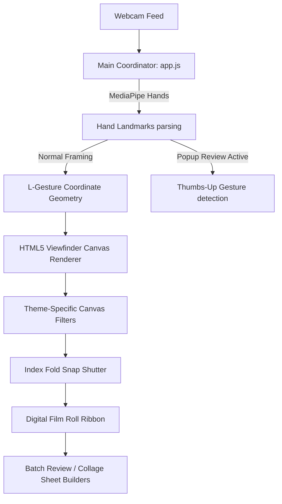

# SNIP SNAP! 📸 // Gesture Retro Film Camera

An interactive, premium web-based camera application that combines hand gesture computer vision with retro 35mm film photography aesthetics. By using **MediaPipe**, the application tracks your hand landmarks to form a dynamic viewfinder frame in mid-air, detects index-finger trigger-pulls to snap photos, and compiles captured shots into customizable film sheets, vertical strips, and contact sheets.

---

## ✨ Features

### 1. 🫱 Mid-Air Hand Gesture Controls
* **Dual "L" Frame Viewfinder:** Form an "L" shape with both hands (index finger and thumb) to spawn a glowing, responsive, and rotatable crop frame. 
* **Dynamic Focus & Depth Blur:** When framing is active, the background outside your hand viewfinder smoothly transitions to monochrome and darkens, drawing complete focus to the subject inside the frame.
* **Physics-Based Smoothing (Lerp):** Viewfinder position, size, and rotation angle are interpolated using linear and angular lerp (`theta`) for a fluid, organic cinematic feel.
* **Index Fold Trigger:** While holding the frame, fold the index finger of either hand (like pulling a physical camera shutter trigger) to snap a shot.

### 2. 📱 Fully Mobile Friendly & Responsive
* **Vertical / Portrait Mode:** The interface dynamically flows into portrait viewports on mobile devices and vertical windows.
* **Horizontal Negative strip:** The simulated 35mm film ribbon adapts into a sleek, horizontal touch-scrolling negative bar at the bottom of the screen.

### 3. 🎞️ Batch Negative review popup
* **Every 4 Snapshots:** To simulate review cycles, the application automatically pauses capturing every 4 snapshots and presents an overlay displaying the 4 latest captures.
* **Thumbs Up Gesture Close:** You can close the review popup simply by raising a hand in a **Thumbs Up** gesture. The guide icon will glow green, play a confirmation beep, and close the popup after 500ms so you can continue shooting.
* A manual "Close" button is also provided.

### 4. 🎨 Curated Art Themes
Swap between three unique color profiles, which dynamically update filters, grid layouts, and export canvas styles:
* **CLASSIC:** High-contrast film grains, retro off-white Polaroid paper backgrounds, and monochrome outer overlays.
* **NEON:** Vibrant cyan and purple hues with high saturation filters.
* **SAGE:** Organic olive-greens, warm sepia undertones, and clean, solid styling.

### 5. 🎞️ 35mm Digital Film Roll
* Negatives are compiled onto a simulated 35mm film strip.
* Each negative card features randomized tilt rotations, timestamps, and quick action buttons (Individual Download & Discard).
* Click any negative to open a dedicated **Polaroid Modal**, allowing you to write custom handwritten captions and download or copy the finished photo sheet to your clipboard.

### 6. 📑 Custom Collage Sheet Maker
Combine your captures into high-quality sheets of up to 12 frames:
* **2x2 Grid:** Compiles four styled polaroid cards complete with captions and metadata.
* **35mm Strip:** A vertical strip resembling physical negative roll cuttings with film brand numbering.
* **Contact Sheet:** A 3x4 photographer's proof sheet with handwritten red marker annotations, checks, and frame numbers.

### 7. 🔊 Synthesized Audio HUD
Uses the **Web Audio API** to synthesize retro hardware sound effects on the fly:
* Low-frequency mechanical mirror slap and high-frequency shutter snap for photos.
* Eased double-beeps for autofocus lock.
* Rising double-beep confirm tones for thumbs-up approval.

---

## 🛠️ Technical Architecture & Under-the-Hood

This application is built entirely as a client-side vanilla web app (HTML5, CSS3, ES6 JavaScript) utilizing MediaPipe Hands for landmark extraction:



### 📐 Gesture Geometry & Inset Math
The application calculates a 2D bounding box from the index finger joint intersections (`getLCorner`).
* **Viewfinder Rotation:**
  $$\theta = \text{atan2}(U_y, U_x)$$
  The angle of the viewfinder frame rotates dynamically based on the slope of the primary hand's index finger.
* **Inset Margin:** To ensure fingers don't show up in the photo itself, a margin is calculated dynamically using the palm size distance:
  $$\text{palmSize} = \sqrt{(P_{0x} - P_{9x})^2 + (P_{0y} - P_{9y})^2}$$
  The crop rectangle is inset by $0.42 \times \text{palmSize}$ inwards, pulling the final picture clear of the user's framing fingers.

---

## 🚀 How to Run Locally

Because the application uses ES6 modules (`import`/`export`), modern browsers restrict importing them directly from local file paths (`file://`) due to CORS security policies.

### Run with a Local Web Server

1. Open your terminal in the project directory.
2. Spin up a simple local server:
   * **Node.js:**
     ```bash
     npx serve .
     ```
   * **Python:**
     ```bash
     python -m http.server 8000
     ```
3. Open `http://localhost:3000` (or `http://localhost:8000`) in Chrome, Safari, or Edge.
4. Grant camera permissions, raise your hands, and enjoy!

---

## 📂 Project Structure

* [index.html](file:///D:/CODE/AG%20TEST PLAYGROUND/retro-film-cam/index.html) — HTML layout containing viewfinder panels, modals, and the popup.
* [app.js](file:///D:/CODE/AG%20TEST%20PLAYGROUND/retro-film-cam/app.js) — Main coordinator managing MediaPipe streams and the animation rendering loop.
* [style.css](file:///D:/CODE/AG%20TEST%20PLAYGROUND/retro-film-cam/style.css) — Custom responsive stylesheets with mobile layouts and themes.
* `modules/` — Specialized ES6 modules:
  - [state.js](file:///D:/CODE/AG%20TEST%20PLAYGROUND/retro-film-cam/modules/state.js) — Central state parameters.
  - [audio.js](file:///D:/CODE/AG%20TEST%20PLAYGROUND/retro-film-cam/modules/audio.js) — Audio synthesis engine.
  - [math.js](file:///D:/CODE/AG%20TEST%20PLAYGROUND/retro-film-cam/modules/math.js) — Geometry equations and gesture detectors.
  - [collage.js](file:///D:/CODE/AG%20TEST%20PLAYGROUND/retro-film-cam/modules/collage.js) — Collage sheet builders.
  - [ui.js](file:///D:/CODE/AG%20TEST%20PLAYGROUND/retro-film-cam/modules/ui.js) — DOM event handlers and UI builders.
